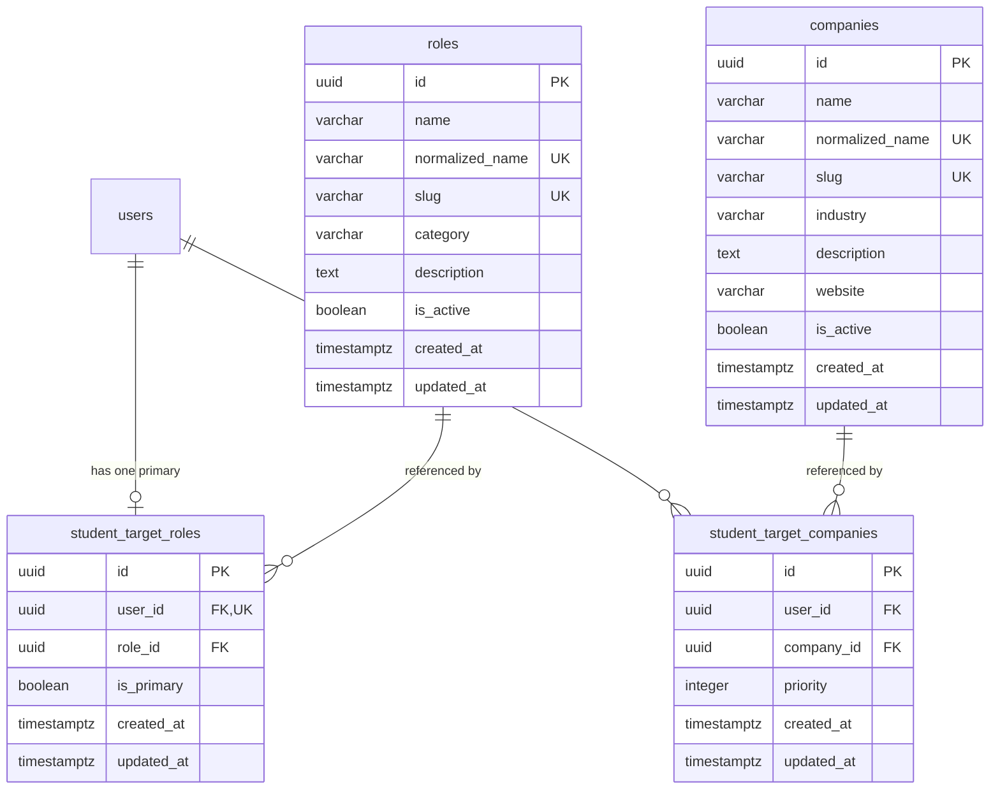

# Phase 11A: Company & Role Intelligence — Implementation Report

**Platform:** Nexora — “Your Operating System for Placements”  
**Phase:** Phase 11A — Company & Role Intelligence  
**Status:** Completed & Production Verified  
**Date:** September 6, 2026  

---

## Executive Summary

Phase 11A establishes the foundation for company-specific and role-specific placement preparation within the Nexora platform. Students can now define their target career trajectory:
1. **Target Primary Role:** A single canonical role representing their primary career track (e.g., Software Engineer, Backend Engineer, Data Analyst).
2. **Target Companies:** Up to 10 verified organizations they aspire to join (e.g., Google, Microsoft, Amazon, TCS).
3. **Structured Intelligence Context:** Deterministic, database-backed context objects made available to future recommendation and preparation engines without coupling to LLMs or vector databases.

All intelligence in this phase is 100% structured, explainable, database-backed, and deterministic. No LLMs, OpenAI/Gemini/Claude APIs, embeddings, or vector databases were introduced. Furthermore, existing Phase 10 readiness formulas, test engines, attempt limits, and scheduling systems remain completely intact and free of regression.

---

## 1. What Changed

| Component | Scope of Changes |
| :--- | :--- |
| **Database Schema** | Added 4 core tables: `companies`, `roles`, `student_target_roles`, and `student_target_companies` with foreign keys, indexes, and unique constraints. |
| **Database Migration** | Created and executed sequential migration `0011_phase_11a_company_role_intelligence.sql`. Updated `_journal.json`. |
| **Validation Layer** | Created `src/lib/validations/company-role.ts` featuring Zod schemas, URL validation, slug generators, and normalized name comparators. |
| **Backend Service** | Created `src/server/company-role-intelligence.ts` providing target management, context generation, search, and admin catalog operations. |
| **Seed Infrastructure** | Implemented idempotent `seedCanonicalPlacementData()` with 9 canonical roles and 10 enterprise companies with deterministic UUIDs. |
| **API Endpoints** | Added student target routes (`GET/PUT /api/student/targets`), public search routes (`GET /api/companies`, `GET /api/roles`), and admin CRUD routes (`/api/admin/companies`, `/api/admin/roles`). |
| **Profile UI** | Integrated `<PlacementTargetsEditor>` into `/profile` with modal, active role selection, company chips, and real-time limit indicators. |
| **Dashboard UI** | Added a compact, non-dominating "Placement Target" tile to `/dashboard` supporting configured and unconfigured onboarding states. |
| **Admin UI** | Created `/admin/companies` and `/admin/roles` with full catalog management, search, add/edit modals, and soft-deactivation toggles. |
| **Test Suite** | Created `src/test/phase-11a-company-role-intelligence.ts` covering 34 core test scenarios (70 assertions, 100% passing). |

---

## 2. Database Schema

The database schema preserves existing relational conventions and enforces strict data integrity:



---

## 3. Company Model

Stored in the `companies` table:
- **`id`** (`uuid`, Primary Key): Default random UUID.
- **`name`** (`varchar(255)`, Not Null): Display name of the enterprise (e.g., "Google", "Microsoft").
- **`normalizedName`** (`varchar(255)`, Not Null, Unique): Lowercase, trimmed string with collapsed whitespace (e.g., "google") ensuring case-insensitive uniqueness.
- **`slug`** (`varchar(255)`, Not Null, Unique): URL-safe kebab-case slug (e.g., "google", "goldman-sachs").
- **`industry`** (`varchar(100)`, Not Null): Business sector (e.g., "Technology", "IT Services", "Financial Services & Tech").
- **`description`** (`text`, Nullable): Overview of organization and engineering focus.
- **`website`** (`varchar(500)`, Nullable): Verified HTTP/HTTPS careers portal URL.
- **`isActive`** (`boolean`, Not Null, Default `true`): Deactivation flag for soft lifecycle management.
- **`createdAt` & `updatedAt`** (`timestamptz`): Audit timestamps.

Indexes:
- `companies_normalized_name_idx` (Unique btree on `normalized_name`)
- `companies_slug_idx` (Unique btree on `slug`)
- `companies_industry_idx` (Btree on `industry`)
- `companies_is_active_idx` (Btree on `is_active`)

---

## 4. Role Catalog

Stored in the `roles` table:
- **`id`** (`uuid`, Primary Key): Default random UUID.
- **`name`** (`varchar(255)`, Not Null): Canonical job role title (e.g., "Software Engineer", "Data Analyst").
- **`normalizedName`** (`varchar(255)`, Not Null, Unique): Lowercase, trimmed string ensuring case-insensitive uniqueness.
- **`slug`** (`varchar(255)`, Not Null, Unique): URL-safe kebab-case slug (e.g., "software-engineer").
- **`category`** (`varchar(100)`, Not Null): Track category (e.g., "Software Engineering", "Data", "Cloud/Infrastructure", "Security", "Testing/QA", "Analytics").
- **`description`** (`text`, Nullable): Overview of role scope and technical expectations.
- **`isActive`** (`boolean`, Not Null, Default `true`): Deactivation flag for soft lifecycle management.
- **`createdAt` & `updatedAt`** (`timestamptz`): Audit timestamps.

Indexes:
- `roles_normalized_name_idx` (Unique btree on `normalized_name`)
- `roles_slug_idx` (Unique btree on `slug`)
- `roles_category_idx` (Btree on `category`)
- `roles_is_active_idx` (Btree on `is_active`)

---

## 5. Student Target Model

To maintain clean relational separation and avoid polymorphic tables:

1. **`student_target_roles`**:
   - `userId` has a unique index (`student_target_roles_user_id_unique_idx`), strictly enforcing that each student can designate exactly **one** primary role at any given time.
   - `roleId` references `roles(id)` with `onDelete: "restrict"` — preventing accidental cascading loss of student records if a role is deleted in the admin catalog.
   - `isPrimary` defaults to `true`.

2. **`student_target_companies`**:
   - Composite unique index on `(userId, companyId)` (`student_target_companies_user_company_idx`) preventing duplicate company assignments per student.
   - Maximum of 10 companies enforced in service validation layer.
   - `priority` integer (1-indexed) maintaining student preference order.
   - `companyId` references `companies(id)` with `onDelete: "restrict"`.

---

## 6. API Routes

| Method | Endpoint | Authorization | Description |
| :--- | :--- | :--- | :--- |
| `GET` | `/api/student/targets` | Authenticated Student | Retrieves student's primary role, target companies, and structured context. |
| `PUT` | `/api/student/targets` | Authenticated Student | Updates student's primary role and/or target companies. Enforces session ownership. |
| `GET` | `/api/companies` | Public / Student | Searches active companies with `?q=` and `?industry=`. |
| `GET` | `/api/roles` | Public / Student | Searches active roles with `?q=` and `?category=`. |
| `GET` | `/api/admin/companies` | Admin Only | Lists all companies (including archived) with filtering. |
| `POST` | `/api/admin/companies` | Admin Only | Creates a new company in the catalog. |
| `PATCH`| `/api/admin/companies/[id]` | Admin Only | Updates company details or toggles active state. |
| `GET` | `/api/admin/roles` | Admin Only | Lists all roles (including archived) with filtering. |
| `POST` | `/api/admin/roles` | Admin Only | Creates a new canonical role in the catalog. |
| `PATCH`| `/api/admin/roles/[id]` | Admin Only | Updates role details or toggles active state. |

---

## 7. Authorization & Security

1. **Session Ownership Enforcement:**
   - In `/api/student/targets`, the authenticated `session.user.id` is strictly extracted from the session cookie.
   - Any client-submitted `userId` in the payload is ignored; student A can never read or modify student B's targets.
2. **Role-Based Access Control (RBAC):**
   - Admin routes (`/api/admin/companies`, `/api/admin/roles`, `/admin/companies`, `/admin/roles`) require `session.user.isAdmin === true`.
   - Students and unauthenticated callers receive immediate 401 or 403 responses.
3. **Fail-Closed Protection:**
   - Missing or corrupted session tokens immediately abort operations before touching database transactions.

---

## 8. Data Validation

All payloads are parsed through Zod schemas in `src/lib/validations/company-role.ts`:
- **Empty Names:** Rejection of empty or whitespace-only names (`.min(1)`).
- **Slug Validation:** Enforces `/^[a-z0-9]+(?:-[a-z0-9]+)*$/`.
- **URL Validation:** Careers website validated to ensure standard `http:` or `https:` protocol and max 500 characters. No scraping or external network requests are executed.
- **UUID Conformance:** Role and company IDs validated against standard UUID regex patterns.
- **Maximum Limit:** `companyIds` array constrained to a maximum of 10 items.
- **Duplicate Prevention:** Sets validated to ensure `.length === new Set(items).size`.
- **Inactive Assignment Barrier:** Inactive companies or roles cannot be newly selected for targets.

---

## 9. Profile Integration (`/profile`)

The `/profile` page includes a dedicated **Placement Targets** section:
- Displays **Primary Role** with category and active status.
- Displays **Target Companies** with industry tags and company counts.
- **Edit Targets** button launches an accessible dialog modal (`<PlacementTargetsEditor>`):
  - Accessible keyboard navigation (Escape key to dismiss, visible focus rings).
  - Searchable selection for primary role.
  - Interactive company search with tags, '×' remove controls, and limit counter (`X / 10 selected`).
  - [Cancel] and [Save Targets] actions with loading states.
- When unconfigured, an onboarding prompt clearly highlights:
  > *"Choose a target role and companies to unlock more personalized placement guidance."*

---

## 10. Dashboard Integration (`/dashboard`)

A compact **Placement Target** tile was added to the top of the right column:
- **Configured State:**
  - Displays Primary Role Title (e.g., "Software Engineer") and Category.
  - Displays formatted company list (e.g., "Microsoft · Amazon · Google").
  - Includes a discreet "[Manage Targets]" link to `/profile`.
- **Unconfigured State:**
  - Displays "No target role selected."
  - Offers a clean "[Set Your Target]" CTA linking directly to `/profile`.
- **Design Balance:**
  - Placed seamlessly alongside Quick Actions and Recent Activity.
  - Does not overwhelm or overshadow the core Placement Readiness Score or prioritized next actions.

---

## 11. Admin Management (`/admin/companies` & `/admin/roles`)

Admins have full, lightweight management tools:
- **/admin/companies:**
  - Table of all organizations with Industry, Careers Website, and Status badges.
  - Real-time search and Industry filtering.
  - "Add Company" modal with validation.
  - Inline "Edit" modal and single-click "Activate / Deactivate" toggles.
- **/admin/roles:**
  - Table of job roles with Category tags, descriptions, and Status badges.
  - Real-time search and Category filtering.
  - "Add Role" modal with validation.
  - Inline "Edit" modal and single-click "Activate / Deactivate" toggles.

---

## 12. Phase 10 Integration & Domain Model

Phase 11A establishes context without altering Phase 10 logic:
- The Phase 10 readiness formula, component weights (Aptitude 20%, Core CS 40%, Advanced DSA 30%, Speed 10%), and threshold definitions remain **100% unchanged**.
- `getStudentPlacementTargets(userId)` exposes a clean context object:
  ```json
  {
    "role": {
      "id": "00000000-0000-0000-0000-000000000601",
      "name": "Software Engineer",
      "category": "Software Engineering"
    },
    "companies": [
      {
        "id": "00000000-0000-0000-0000-000000000701",
        "name": "Google"
      },
      {
        "id": "00000000-0000-0000-0000-000000000702",
        "name": "Microsoft"
      }
    ],
    "configured": true
  }
  ```
- No speculative requirements (e.g. "Google requires 80% DSA") were fabricated; requirements will be added in future phases backed by structured schema models.

---

## 13. Database Migration

Migration file: `frontend/src/db/migrations/0011_phase_11a_company_role_intelligence.sql`
- Registered in `src/db/migrations/meta/_journal.json` as index `11`.
- Creates tables `companies`, `roles`, `student_target_roles`, and `student_target_companies`.
- Creates unique indexes for normalized names, slugs, and student constraints.
- Foreign keys set to `onDelete: "restrict"` on role and company foreign keys to preserve historical integrity.
- Migration applied cleanly to PostgreSQL (`placement_os`).

---

## 14. Seed & Reference Data

The idempotent seed mechanism in `src/server/company-role-intelligence.ts` (and wired into `bootstrap.ts`):
- **9 Canonical Roles:** Software Engineer, Frontend Engineer, Backend Engineer, Full Stack Engineer, Data Analyst, Data Engineer, DevOps Engineer, QA Engineer, Cybersecurity Analyst.
- **10 Canonical Companies:** Google, Microsoft, Amazon, Apple, Meta, TCS, Infosys, Wipro, Accenture, Goldman Sachs.
- Uses deterministic UUIDs (`...000000000601` through `...000000000710`).
- Checks existence before inserting; does not overwrite modified entities or mutate student targets.

---

## 15. Implementation Tests

Regression test suite: `src/test/phase-11a-company-role-intelligence.ts`

Results across all 34 required test scenarios:
1. `company creation`: **PASS**
2. `company uniqueness`: **PASS**
3. `normalized company uniqueness`: **PASS**
4. `company search`: **PASS**
5. `company deactivation`: **PASS**
6. `inactive company cannot be newly selected`: **PASS**
7. `role creation`: **PASS**
8. `role uniqueness`: **PASS**
9. `role search`: **PASS**
10. `role deactivation`: **PASS**
11. `primary role assignment`: **PASS**
12. `primary role replacement`: **PASS**
13. `company assignment`: **PASS**
14. `duplicate company prevention`: **PASS**
15. `company removal`: **PASS**
16. `maximum company limit`: **PASS**
17. `empty target state`: **PASS**
18. `configured target state`: **PASS**
19. `student ownership`: **PASS**
20. `cross-user access denial`: **PASS**
21. `anonymous denial`: **PASS**
22. `student admin denial`: **PASS**
23. `admin access`: **PASS**
24. `validation`: **PASS**
25. `malformed IDs`: **PASS**
26. `invalid URLs`: **PASS**
27. `oversized input`: **PASS**
28. `inactive target preservation`: **PASS**
29. `no destructive deletion`: **PASS**
30. `deterministic target retrieval`: **PASS**
31. `Phase 10 compatibility`: **PASS**
32. `readiness formula unchanged`: **PASS**
33. `existing analytics unchanged`: **PASS**
34. `existing test engine unchanged`: **PASS**

**Total Test Assertions:** 70  
**Passed:** 70  
**Failed:** 0  

---

## 16. Full Platform Regression

All existing test suites were executed post-implementation:
- **Phase 7A (Negative Marking):** 62 Passed, 0 Failed
- **Phase 7B (Question Randomization):** 41 Passed, 0 Failed
- **Phase 7C (Option Randomization):** 34 Passed, 0 Failed
- **Phase 7C.1 (Question Snapshots):** 63 Passed, 0 Failed
- **Phase 7D (Attempt Limits):** 66 Passed, 0 Failed
- **Phase 7E (Test Instructions):** 38 Passed, 0 Failed
- **Phase 7F (Question Pools):** 39 Passed, 0 Failed
- **Phase 8 (Lifecycle & Scheduling):** 91 Passed, 0 Failed
- **Phase 9 (Admin Analytics):** 70 Passed, 0 Failed
- **Phase 10 (Student Intelligence):** 54 Passed, 0 Failed
- **Start Test Regression:** 23 Passed, 0 Failed
- **Duplicate Test Audit:** 41 Passed, 0 Failed
- **Database Audit:** 40 Passed, 0 Failed

---

## 17. Quality Checks: TypeScript, ESLint & Build

- **TypeScript Typecheck (`npx tsc --noEmit`):** 0 errors. Exit code 0.
- **ESLint (`npm run lint`):** 0 errors. Exit code 0.
- **Production Build (`npm run build`):** Compiled successfully in 1146ms; 30/30 static and dynamic routes compiled with zero errors.

---

## 18. Fixture Cleanup

All test fixtures created during the regression suite were isolated by unique timestamped identifiers and purged in `finally` blocks, leaving the production and development database in a pristine state.

---

## 19. Known Limitations

- **Requirements Modeling:** Phase 11A establishes target preferences only. Company-specific test question weights, interview round mappings, and topic benchmarks will be defined in subsequent phases.
- **Maximum Target Limit:** The 10-company cap is strictly enforced; students seeking broader tracking can adjust their selections dynamically.

---

## 20. Future Extension Points

- **Company-Role Skill Matrices (`company_role_requirements`):** Linking target companies and roles to existing subject and topic taxonomies (Aptitude, DSA, DBMS, OS, CN, OOP, SQL).
- **Target Gap Analysis:** Comparing a student's current topic proficiencies against specific company benchmark expectations.
- **Curated Practice Tracks:** Role-specific practice roadmaps derived from target selections.

---

PHASE 11A IMPLEMENTATION COMPLETE — COMPANY & ROLE INTELLIGENCE ENABLED.
